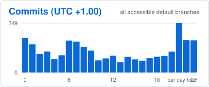
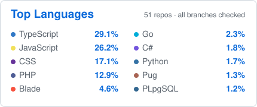

<strong>HELLO THERE — I'M WILLIAMS 👋</strong>

<strong>Software Engineer · Backend · Platform · Infrastructure · Distributed Systems · Security · IoT & Connected Systems</strong>

I build <strong>production software across backend engineering, platform infrastructure, distributed systems, security tooling, IoT and connected devices, web and mobile applications, desktop clients, developer tooling, financial and business platforms, CMS products, data and decision systems, and cloud services</strong>.

My work spans the full path from client, device, or protocol to production infrastructure: <strong>application architecture, APIs, transport and service contracts, authentication and authorization, data systems, messaging, queues, integrations, concurrency control, deployment, observability, reliability, and operational recovery</strong>.

I am especially interested in systems that must remain correct when <strong>money, data, devices, networks, external providers, concurrency, and failures</strong> are involved.

  
  
  

---

<strong>GITHUB ACTIVITY</strong>

<table>
<tr>
<td width="50%" align="center"></td>
<td width="50%" align="center"></td>
</tr>
<tr>
<td width="50%" align="center"></td>
<td width="50%" align="center"></td>
</tr>
</table>

Generated from GitHub data and refreshed every six hours. Each card uses its own explicitly labelled scope.

---

<strong>WHAT I BUILD</strong>

<table>
<tr>
<td width="50%" valign="top"><strong>Backend & API platforms</strong> Production APIs, auth, ownership controls, integrations, background processing, service boundaries and operational systems.</td>
<td width="50%" valign="top"><strong>Distributed systems & protocols</strong> RPC, binary framing, persistent connections, multiplexing, deadlines, cancellation, backpressure, retries, pooling, discovery, routing and failover.</td>
</tr>
<tr>
<td valign="top"><strong>Workflow & integration platforms</strong> Triggers, conditions, actions, webhooks, provider abstraction, workers, replay, API keys, workspaces and multi-tenant execution.</td>
<td valign="top"><strong>Security & supply-chain tooling</strong> Vulnerability intelligence, AST analysis, dependency health, Git security, SBOMs, secrets, container checks and local-first policy tooling.</td>
</tr>
<tr>
<td valign="top"><strong>Financial, risk & business systems</strong> Transactions, ledgers, budgets, reconciliation, payments, credit-risk decisioning, contracts, inventory, reporting and accounting-sensitive workflows.</td>
<td valign="top"><strong>CMS, publishing & commerce</strong> Publishing lifecycles, builders, themes, plugins, media, taxonomy, forms, catalogues, inventory, checkout and payment adapters.</td>
</tr>
<tr>
<td valign="top"><strong>Storage & transfer systems</strong> Streaming uploads, resumable downloads, HTTP byte ranges, transfer sessions, checksums, quotas, caching and distributed throttling.</td>
<td valign="top"><strong>Developer tooling & DX</strong> CLI applications, API scaffolding, automation, package tooling, OpenAPI, diagnostics, release tooling and engineering workflows.</td>
</tr>
<tr>
<td valign="top"><strong>Web, mobile & desktop</strong> React, React Native/Expo, desktop clients, Laravel interfaces, WordPress products, dashboards and accessible application shells.</td>
<td valign="top"><strong>IoT & connected systems</strong> Device-backed services, telemetry, real-time events, alerts, service connectivity and connected operational platforms.</td>
</tr>
<tr>
<td valign="top"><strong>Cloud & production operations</strong> Linux, containers, databases, caching, queues, CI/CD, health/readiness, monitoring, backups, recovery and multi-cloud deployment.</td>
<td valign="top"><strong>Data, analytics & decision systems</strong> Aggregation pipelines, financial analytics, statistical modelling, diagnostics, explainability, stress testing and decision-policy layers.</td>
</tr>
<tr>
<td colspan="2" valign="top"><strong>Engineering documentation & education</strong> Architecture notes, security contracts, release runbooks, system-design material and a structured software-engineering handbook.</td>
</tr>
</table>

---

<strong>PUBLIC ENGINEERING REPOSITORY MAP</strong>

Complete authored public engineering set. Upstream forks and coursework are separated below.

<table>
<tr>
<td width="50%" valign="top"><a href="https://github.com/wbizmo/argus-rpc"><strong>Argus RPC</strong></a> Custom TypeScript RPC runtime over persistent TCP: binary framing, multiplexing, deadlines, cancellation, bounded backpressure, retries, health-aware pooling, circuit breaking, heartbeats and observability.  <code>TypeScript</code> <code>Node.js</code> <code>TCP</code> <code>Vitest</code></td>
<td width="50%" valign="top"><a href="https://github.com/wbizmo/nommo-orchestrator"><strong>NOMMO Orchestrator</strong></a> Distributed-systems control plane for node/service registration, heartbeats, failure detection, routing, failover, recovery and cluster observability.  <code>TypeScript</code> <code>Fastify</code> <code>Service Discovery</code></td>
</tr>
<tr>
<td valign="top"><a href="https://github.com/wbizmo/inflowforge-api"><strong>inFlowForge API</strong></a> Multi-tenant workflow automation with triggers, conditions, actions, webhooks, queues, execution logs and external integrations.  <code>Fastify</code> <code>PostgreSQL</code> <code>Prisma</code> <code>Redis</code> <code>BullMQ</code></td>
<td valign="top"><a href="https://github.com/wbizmo/syncgrid-api"><strong>SyncGrid API</strong></a> Unified integration gateway for payments, email, provider routing/failover, API keys, webhooks, replay, workspaces and usage analytics.  <code>Fastify</code> <code>Prisma</code> <code>Redis</code> <code>BullMQ</code> <code>Docker</code></td>
</tr>
<tr>
<td valign="top"><a href="https://github.com/wbizmo/vaultbox-api"><strong>VaultBox API</strong></a> Secure storage API with streaming uploads, resumable/parallel downloads, HTTP Range semantics, atomic quota reservation, throttling and dependency health.  <code>Fastify</code> <code>Neon PostgreSQL</code> <code>Upstash Redis</code> <code>HTTP Range</code></td>
<td valign="top"><a href="https://github.com/wbizmo/toolip"><strong>Toolip</strong></a> Developer-first supply-chain security CLI: vulnerability intelligence, AST scanning, Git/container audits, SBOMs, encrypted secrets, reports and MCP.  <code>TypeScript</code> <code>OSV</code> <code>deps.dev</code> <code>CycloneDX</code> <code>SPDX</code></td>
</tr>
<tr>
<td valign="top"><a href="https://github.com/wbizmo/launchstack-cli"><strong>LaunchStack CLI</strong></a> Backend scaffolding and deployment toolkit generating structured Fastify APIs with auth, persistence, docs, tests, Docker and CI.  <code>TypeScript</code> <code>Fastify</code> <code>Prisma</code> <code>PostgreSQL</code> <code>Zod</code></td>
<td valign="top"><a href="https://github.com/wbizmo/cashflowr"><strong>CashFlowr</strong></a> Personal-finance workspace with ownership controls, budgets, goals, recurring cash flow, idempotency, concurrency handling and analytics.  <code>React</code> <code>Express</code> <code>MongoDB</code> <code>Mongoose</code> <code>JWT</code></td>
</tr>
<tr>
<td valign="top"><a href="https://github.com/wbizmo/credit-risk-intelligence-dashboard"><strong>CRIX — Credit Risk Intelligence</strong></a> Stateless decisioning API for PD/LGD/EAD/expected loss, challenger analysis, uncertainty, reason codes, stress scenarios and lending policy.  <code>Fastify</code> <code>Python</code> <code>scikit-learn</code> <code>XGBoost</code> <code>SHAP</code></td>
<td valign="top"><a href="https://github.com/wbizmo/covenant"><strong>Covenant</strong></a> Contract lifecycle management for agreements, documents, categories, renewal tracking, expiry state, search and operational dashboards.  <code>PHP</code> <code>Laravel</code> <code>Blade</code> <code>MySQL</code></td>
</tr>
<tr>
<td valign="top"><a href="https://github.com/wbizmo/pulse-platform"><strong>Pulse CMS</strong></a> Security-first publishing and commerce platform with MFA/RBAC, content lifecycle, builder, themes/plugins, inventory ledger, checkout, payment adapters and operations.  <code>Laravel</code> <code>Blade</code> <code>MySQL</code> <code>Tailwind CSS</code></td>
<td valign="top"><a href="https://github.com/wbizmo/pulseforms"><strong>Wbizmo Form Builder / PulseForms</strong></a> WordPress-native form builder with secure submissions, uploads, email notifications, spam protection, observability and structured field definitions.  <code>PHP</code> <code>WordPress</code> <code>JavaScript</code></td>
</tr>
<tr>
<td valign="top"><a href="https://github.com/wbizmo/origin-wp"><strong>Origin WP</strong></a> Lightweight Elementor-ready WordPress theme with improved blogging, post templates, admin branding and WooCommerce compatibility.  <code>PHP</code> <code>WordPress</code> <code>Elementor</code> <code>WooCommerce</code></td>
<td valign="top"><a href="https://github.com/wbizmo/pulsewp-theme"><strong>PulseWP</strong></a> Business-focused WordPress theme with responsive layouts, Customizer integration, Gutenberg support and form/plugin styling.  <code>PHP</code> <code>WordPress</code> <code>Gutenberg</code> <code>CSS</code></td>
</tr>
<tr>
<td valign="top"><a href="https://github.com/wbizmo/nairabank"><strong>NairaBank</strong></a> Frontend-only Nigerian retail-banking dashboard simulation focused on domain modelling, responsive financial presentation, async states and test discipline.  <code>React</code> <code>TypeScript</code> <code>Vite</code> <code>Zustand</code> <code>Recharts</code></td>
<td valign="top"><a href="https://github.com/wbizmo/trove-portfolio-dashboard"><strong>Trove Portfolio Dashboard</strong></a> Responsive investment portfolio dashboard with feature-based architecture, service boundaries and client-side financial calculations.  <code>React</code> <code>TypeScript</code> <code>Vite</code></td>
</tr>
<tr>
<td colspan="2" valign="top"><a href="https://github.com/wbizmo/wbizmo-software-engineering-handbook"><strong>Software Engineering Handbook</strong></a> Structured handbook spanning web fundamentals through APIs, databases, testing, containers, distributed systems, observability, platform engineering and cloud architecture.</td>
</tr>
</table>

<strong>Learning, coursework & upstream forks</strong>

 
<table>
<tr><td width="50%"><a href="https://github.com/wbizmo/Web-Dev-For-Beginners"><strong>Web Dev for Beginners</strong></a> Fork of Microsoft's web-development curriculum.</td><td width="50%"><a href="https://github.com/wbizmo/Meta-Front-End-Developer"><strong>Meta Front-End Developer</strong></a> Coursework, assignments and reference-material fork.</td></tr>
<tr><td><a href="https://github.com/wbizmo/m4l1_managing_a_project"><strong>m4l1 Managing a Project</strong></a> Meta course exercise fork.</td><td><a href="https://github.com/wbizmo/altschool-opensource-names"><strong>AltSchool Open Source Names</strong></a> Classroom open-source contribution fork.</td></tr>
<tr><td><a href="https://github.com/wbizmo/kubernetes-the-hard-way"><strong>Kubernetes the Hard Way</strong></a> Fork of Kelsey Hightower's infrastructure learning project.</td><td><a href="https://github.com/wbizmo/vitest-when"><strong>vitest-when</strong></a> Fork of the upstream Vitest stubbing utility.</td></tr>
<tr><td><a href="https://github.com/wbizmo/ai-job-search"><strong>AI Job Search</strong></a> Fork of the upstream local AI job-application workflow.</td><td><a href="https://github.com/wbizmo/voicebox"><strong>Voicebox</strong></a> Fork of the upstream open-source AI voice studio.</td></tr>
</table>

---

<strong>PUBLISHED PRODUCTS</strong>

<table>
<tr>
<td width="50%" valign="top"><strong>Toolip — Security & Supply-Chain CLI</strong> Vulnerability intelligence, dependency analysis, Git/container security, SBOM generation and encrypted local secrets management.    </td>
<td width="50%" valign="top"><strong>LaunchStack CLI — Backend Scaffolding</strong> Fastify/TypeScript API generation with Prisma/PostgreSQL, auth, Zod, OpenAPI, Docker, CI and deployment presets.    </td>
</tr>
<tr>
<td valign="top"><strong>Origin WP</strong> Lightweight Elementor-ready theme with improved blog/post layouts, admin branding and WooCommerce compatibility.   </td>
<td valign="top"><strong>Wbizmo Form Builder</strong> WordPress-native form builder with secure submissions, notifications, validation, uploads, spam controls and extensible fields.   </td>
</tr>
</table>

---

<strong>TECH STACK</strong>

<table>
<tr>
<td width="50%" valign="top"><strong>Languages</strong>  
       </td>
<td width="50%" valign="top"><strong>Backend & APIs</strong>  
      </td>
</tr>
<tr>
<td valign="top"><strong>Web, Mobile, Desktop & CMS</strong>  
      </td>
<td valign="top"><strong>Data, Persistence & Messaging</strong>  
        </td>
</tr>
<tr>
<td valign="top"><strong>Infrastructure & Delivery</strong>  
       </td>
<td valign="top"><strong>Testing, Security & Data Science</strong>  
       </td>
</tr>
</table>

---

<strong>ENGINEERING PRACTICES ACROSS MY REPOSITORIES</strong>

<table>
<tr><td width="50%" valign="top"><strong>Access control & security boundaries</strong> Authentication, authorization, owner-scoped queries/BOLA protection, RBAC, MFA, safe delegation, account lifecycle enforcement and auditability.</td><td width="50%" valign="top"><strong>Concurrency & data integrity</strong> Idempotency, optimistic versioning, compare-and-set updates, atomic reservations/contributions, append-only ledgers and deterministic side effects.</td></tr>
<tr><td valign="top"><strong>Distributed resilience</strong> Deadlines, cancellation, retries, backpressure, circuit breaking, heartbeats, failover, queue processing and graceful degradation.</td><td valign="top"><strong>Observability & operations</strong> Health/readiness, request IDs, timing, bounded logs/metrics, execution history, audits, reconciliation, monitoring and recovery workflows.</td></tr>
<tr><td valign="top"><strong>Security & supply chain</strong> Dependency intelligence, vulnerability matching, AST checks, SBOMs, Git/container audits, secret handling, bounded inputs and safe error surfaces.</td><td valign="top"><strong>Financial correctness</strong> Ownership-aware monetary operations, reconciliation, integer/minor-unit considerations, duplicate-write prevention, policy separation and accounting-sensitive workflows.</td></tr>
<tr><td valign="top"><strong>Protocol & API design</strong> Explicit contracts, binary framing, HTTP semantics, OpenAPI, validation, API keys, provider abstraction, webhooks, replay and backwards-compatible boundaries.</td><td valign="top"><strong>Release discipline</strong> Type checks, linting, tests, build verification, CI gates, reproducible benchmarks, deployment runbooks, backups and rollback/recovery planning.</td></tr>
</table>

---

<strong>RECOGNITION</strong>

  
  
  

Recognition based on CodersRank engineering activity and technology rankings.

---

<strong>ENGINEERING PRINCIPLES</strong>

I value <strong>correctness over cleverness</strong>, explicit boundaries, boring-but-reliable infrastructure, measurable failure handling, narrow service contracts, data integrity, maintainable systems, and tests that protect real behavior rather than simply increase coverage numbers.

---

<strong>CONNECT</strong>

  <a href="https://wbizmo.vercel.app">Portfolio</a> ·
  <a href="https://www.linkedin.com/in/wbizmo">LinkedIn</a> ·
  <a href="https://github.com/wbizmo">GitHub</a> ·
  <a href="https://codepen.io/wbizmo">CodePen</a> ·
  <a href="mailto:wbizmo@gmail.com">Email</a>

