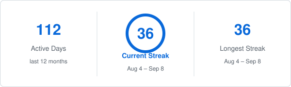

<strong>HELLO THERE — I'M WILLIAMS 👋</strong>

<strong>Software Engineer · Backend · Platform · Infrastructure · Distributed Systems · Security · IoT & Connected Systems</strong>

I build **production software across backend engineering, platform infrastructure, distributed systems, security tooling, IoT and connected devices, web and mobile applications, desktop clients, developer tooling, financial and business platforms, CMS products, data and decision systems, and cloud services**.

My work spans the full path from client, device, or protocol to production infrastructure: **application architecture, APIs, transport and service contracts, authentication and authorization, data systems, messaging, queues, integrations, concurrency control, deployment, observability, reliability, and operational recovery**.

I am especially interested in systems that must remain correct when **money, data, devices, networks, external providers, concurrency, and failures** are involved.

  
  
  

---

<strong>GITHUB ACTIVITY</strong>

  
  

  

  

  

Generated from GitHub data and refreshed every six hours. Lifetime stats, authored-repository language distribution, default-branch commit-time distribution, streaks, and the rolling 90-day contribution-event graph use explicitly different scopes so the numbers remain interpretable.

---

<strong>WHAT I BUILD</strong>

- **Backend & API platforms** — production APIs, authentication, authorization, resource ownership, integrations, background processing, service boundaries, and operational systems.
- **Distributed systems & protocols** — RPC, binary framing, persistent connections, multiplexing, deadlines, cancellation, backpressure, retries, connection pooling, failure detection, service discovery, routing, and failover.
- **Workflow & integration platforms** — triggers, conditions, actions, webhooks, provider abstraction, background workers, replay, API keys, workspaces, and multi-tenant execution.
- **Security & software-supply-chain tooling** — vulnerability intelligence, AST analysis, dependency health, Git security, SBOM generation, secrets management, container checks, policy, and local-first security workflows.
- **Financial, risk & business systems** — transaction workflows, ledgers, budgets, reconciliation, payments, credit-risk decisioning, contracts, inventory, reporting, and accounting-sensitive operations.
- **CMS, publishing & commerce systems** — secure publishing lifecycles, page building, themes, plugins, media, taxonomy, forms, catalogues, inventory, checkout, payment adapters, and operational administration.
- **Storage & transfer systems** — streaming uploads, resumable downloads, HTTP byte ranges, transfer sessions, checksums, quotas, caching, and distributed throttling.
- **Developer tooling & DX** — CLI applications, API scaffolding, automation, package tooling, OpenAPI documentation, local diagnostics, release tooling, and engineering workflows.
- **Web, mobile & desktop products** — responsive React applications, React Native/Expo applications, desktop clients, Laravel interfaces, WordPress products, stateful dashboards, and accessible application shells.
- **IoT & connected systems** — device-backed services, telemetry, real-time events, alerts, service connectivity, and connected operational platforms.
- **Cloud & production operations** — Linux servers, containers, databases, caching, queues, CI/CD, health/readiness, monitoring, backups, recovery, and deployment across multiple cloud providers.
- **Data, analytics & decision systems** — aggregation pipelines, financial analytics, statistical modelling, model diagnostics, explainability, deterministic stress testing, and policy/decision layers.
- **Engineering documentation & education** — architecture notes, security contracts, release runbooks, system-design material, and a structured software-engineering handbook.

---

<strong>PUBLIC ENGINEERING REPOSITORY MAP</strong>

The authored public repositories on this account cover a deliberately broad engineering surface. The table below documents the complete current public engineering set rather than only highlighting a few projects.

| Repository | Engineering surface | Core technologies / concepts |
| --- | --- | --- |
| **[Argus RPC](https://github.com/wbizmo/argus-rpc)** | Custom RPC runtime and wire protocol with multiplexed calls, deadlines, cancellation, bounded backpressure, retries, pooling, circuit breaking, heartbeat and observability. | TypeScript · Node.js · TCP · binary framing · Vitest |
| **[NOMMO Orchestrator](https://github.com/wbizmo/nommo-orchestrator)** | Distributed-systems control plane for node/service registration, heartbeats, failure detection, routing, failover, recovery and cluster observability. | TypeScript · Fastify · service discovery · self-healing |
| **[inFlowForge API](https://github.com/wbizmo/inflowforge-api)** | Multi-tenant workflow automation platform with triggers, conditions, actions, webhooks, queues, execution logs and external actions. | TypeScript · Fastify · PostgreSQL · Prisma · Redis · BullMQ |
| **[SyncGrid API](https://github.com/wbizmo/syncgrid-api)** | Unified integration gateway for payments, email, provider routing/failover, API keys, webhooks, replay, workspaces and usage analytics. | TypeScript · Fastify · Prisma · Redis · BullMQ · Docker · OpenAPI |
| **[VaultBox API](https://github.com/wbizmo/vaultbox-api)** | Secure storage API with streaming uploads, resumable/parallel downloads, HTTP Range semantics, atomic quota reservation, throttling and infrastructure health. | Fastify · Prisma · Neon PostgreSQL · Upstash Redis · HTTP Range |
| **[Toolip](https://github.com/wbizmo/toolip)** | Developer-first software-supply-chain security CLI: vulnerability intelligence, AST scanning, Git/container audits, SBOMs, encrypted secrets, reports and MCP. | TypeScript · Node.js · OSV · deps.dev · CycloneDX · SPDX |
| **[LaunchStack CLI](https://github.com/wbizmo/launchstack-cli)** | Backend scaffolding and deployment toolkit that generates structured Fastify APIs with auth, persistence, docs, tests, Docker and CI. | TypeScript · Fastify · Prisma · PostgreSQL · Zod · OpenAPI · Docker |
| **[CashFlowr](https://github.com/wbizmo/cashflowr)** | Production-oriented personal-finance workspace with transaction ownership, budgets, goals, recurring cash flow, idempotency, concurrency controls and analytics. | React · Express · MongoDB · Mongoose · JWT · Recharts |
| **[CRIX — Credit Risk Intelligence](https://github.com/wbizmo/credit-risk-intelligence-dashboard)** | Stateless credit-risk decisioning API for PD/LGD/EAD/expected loss, challenger analysis, uncertainty, reason codes, stress scenarios and lending policy. | Node.js · Fastify · Python · scikit-learn · XGBoost · SHAP · OptBinning |
| **[Covenant](https://github.com/wbizmo/covenant)** | Contract lifecycle management for agreements, documents, categories, renewal tracking, expiry state, search and operational dashboards. | PHP · Laravel · Blade · MySQL · SQLite · Alpine.js |
| **[Pulse CMS](https://github.com/wbizmo/pulse-platform)** | Security-first publishing and commerce platform with MFA/RBAC, content lifecycle, builder, themes/plugins, inventory ledger, checkout, payment adapters and operations. | PHP · Laravel · Blade · MySQL · Tailwind CSS · queues · payments |
| **[Wbizmo Form Builder / PulseForms](https://github.com/wbizmo/pulseforms)** | WordPress-native form builder with secure submissions, file uploads, email notifications, spam protection, observability and structured field definitions. | PHP · WordPress · JavaScript · email · file security |
| **[Origin WP](https://github.com/wbizmo/origin-wp)** | Lightweight Elementor-ready WordPress theme with improved blogging, post templates, admin branding and WooCommerce compatibility. | PHP · WordPress · CSS · JavaScript · Elementor · WooCommerce |
| **[PulseWP](https://github.com/wbizmo/pulsewp-theme)** | Business-focused WordPress theme with responsive layouts, Customizer integration, Gutenberg support and form/plugin styling. | PHP · WordPress · Gutenberg · Elementor · CSS · JavaScript |
| **[NairaBank](https://github.com/wbizmo/nairabank)** | Frontend-only Nigerian retail-banking dashboard simulation focused on domain modelling, responsive financial presentation, async states and testing discipline. | React · TypeScript · Vite · Zustand · Recharts |
| **[Trove Portfolio Dashboard](https://github.com/wbizmo/trove-portfolio-dashboard)** | Responsive investment portfolio dashboard implementation with feature-based architecture, service boundaries and client-side financial calculations. | React · TypeScript · Vite · responsive UI |
| **[Software Engineering Handbook](https://github.com/wbizmo/wbizmo-software-engineering-handbook)** | Structured engineering handbook spanning web fundamentals through APIs, databases, testing, containers, distributed systems, observability, platform engineering and cloud architecture. | Architecture · backend · distributed systems · platform engineering |

<strong>Learning, coursework & upstream forks on this account</strong>

 

These repositories are retained as learning history, experiments, coursework or upstream forks and are intentionally separated from the authored engineering portfolio above:

- **[Web Dev for Beginners](https://github.com/wbizmo/Web-Dev-For-Beginners)** — fork of Microsoft's Web Dev for Beginners curriculum.
- **[Meta Front-End Developer](https://github.com/wbizmo/Meta-Front-End-Developer)** — fork containing Meta Front-End Developer coursework, assignments and reference material.
- **[m4l1 Managing a Project](https://github.com/wbizmo/m4l1_managing_a_project)** — Meta course exercise fork.
- **[AltSchool Open Source Names](https://github.com/wbizmo/altschool-opensource-names)** — classroom open-source contribution fork.
- **[Kubernetes the Hard Way](https://github.com/wbizmo/kubernetes-the-hard-way)** — fork of Kelsey Hightower's Kubernetes infrastructure learning project.
- **[vitest-when](https://github.com/wbizmo/vitest-when)** — fork of the upstream Vitest stubbing utility.
- **[AI Job Search](https://github.com/wbizmo/ai-job-search)** — fork of the upstream local AI job-application workflow project.
- **[Voicebox](https://github.com/wbizmo/voicebox)** — fork of the upstream open-source AI voice studio.

---

<strong>PUBLISHED OPEN-SOURCE PACKAGES</strong>

<strong>Toolip — Security & Supply-Chain CLI</strong>

Developer-first vulnerability intelligence, dependency analysis, software-supply-chain auditing, Git/container security, SBOM generation and encrypted local secrets management.

<strong>LaunchStack CLI — Backend API Scaffolding Toolkit</strong>

Production backend scaffolding for Fastify, TypeScript, Prisma/PostgreSQL, authentication, Zod, OpenAPI, Docker, CI and deployment presets.

---

<strong>PUBLISHED WORDPRESS PRODUCTS</strong>

<strong>Origin WP</strong>

A lightweight, Elementor-ready WordPress theme with improved blog layouts, enhanced post templates, admin branding and WooCommerce compatibility.

<strong>Wbizmo Form Builder</strong>

A WordPress-native form builder with submission management, email notifications, validation, file uploads, spam controls, custom field types and an extensible architecture.

---

<strong>TECH STACK</strong>

<strong>Languages</strong>

<strong>Backend, APIs & Application Frameworks</strong>

<strong>Web, Mobile, Desktop & CMS</strong>

<strong>Data, Persistence & Messaging</strong>

<strong>Infrastructure, Cloud & Delivery</strong>

<strong>Machine Learning, Analytics & Decisioning</strong>

<strong>Payments, Messaging & Provider Integrations</strong>

<strong>Testing & Verification</strong>

<strong>Protocols, Security & Systems Patterns</strong>

`REST` · `OpenAPI` · `Webhooks` · `TCP/RPC` · `Binary Framing` · `HTTP Range` · `SSE` · `JWT` · `API Keys` · `TOTP MFA` · `RBAC` · `Owner-Scoped Authorization / BOLA Protection` · `Rate Limiting` · `Idempotency` · `Optimistic Concurrency` · `Atomic Writes` · `Append-Only Ledgers` · `Retries` · `Backpressure` · `Deadlines` · `Cancellation` · `Circuit Breaking` · `Service Discovery` · `Failover` · `CycloneDX` · `SPDX` · `OSV` · `deps.dev` · `MCP`

---

<strong>ENGINEERING PRACTICES ACROSS THE REPOSITORIES</strong>

| Area | How it appears in the work |
| --- | --- |
| **Identity & authorization** | Account-state enforcement, token/session revocation, API keys, MFA, granular RBAC, safe delegation, owner-scoped access and BOLA-resistant resource queries. |
| **Correctness & concurrency** | Idempotency keys, replay-safe writes, optimistic versioning, compare-and-set updates, atomic contributions/reservations, immutable snapshots and append-only ledgers. |
| **Distributed resilience** | Bounded queues, backpressure, retries with budgets, deadlines, cancellation, circuit breakers, health-aware pools, heartbeats, failure detection, routing and failover. |
| **Security & supply chain** | Dependency/vulnerability intelligence, AST analysis, Git-history scanning, secrets management, SBOMs, secure uploads, signature verification, throttling and safe error boundaries. |
| **Observability & operations** | Health/readiness endpoints, request IDs, latency measurement, metrics, audit logs, queue/scheduler monitoring, CI gates, deployment checks, backups and recovery runbooks. |
| **Financial & domain integrity** | Minor-unit/integer money where appropriate, ledgers, transaction ownership, budget/goal consistency, payment reconciliation, risk-policy separation and deterministic financial workflows. |
| **Data & decisioning** | Database aggregation, bounded analytics, statistical model development, calibration, challenger analysis, stress scenarios, explainability and independent policy layers. |
| **Client engineering** | Responsive shells, loading/error/empty states, accessible interaction patterns, reusable components, service layers, state management and data visualization. |
| **Release discipline** | Linting, type checking, automated tests, builds, dependency audits, reproducible benchmarks, release checklists and explicit evidence boundaries. |

---

<strong>RECOGNITION</strong>

  
  
  

<i>Recognition based on CodersRank engineering activity and technology rankings.</i>

---

<strong>ENGINEERING PRINCIPLES</strong>

I value **correctness over cleverness**, explicit boundaries, boring-but-reliable infrastructure, measurable failure handling, narrow service contracts, data integrity, bounded resource use, maintainable systems, and tests that protect real behavior rather than simply increase coverage numbers.

My interests span **backend architecture, platform engineering, infrastructure, distributed systems, protocols, security engineering, IoT and connected systems, real-time systems, fintech and business software, developer tooling, reliability engineering, data and decision systems, mobile and desktop systems, CMS/product platforms, and production operations**.

---

<strong>CONNECT</strong>

  <a href="https://wbizmo.vercel.app">Portfolio</a> ·
  <a href="https://www.linkedin.com/in/wbizmo">LinkedIn</a> ·
  <a href="https://github.com/wbizmo">GitHub</a> ·
  <a href="https://codepen.io/wbizmo">CodePen</a> ·
  <a href="mailto:wbizmo@gmail.com">Email</a>

