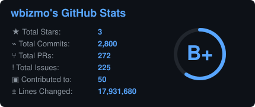
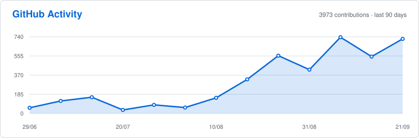

<strong>HELLO THERE — I'M WILLIAMS 👋</strong>

<strong>Software Engineer · Backend · Platform · Infrastructure · IoT & Connected Systems</strong>

I build **production software across backend engineering, platform infrastructure, distributed systems, IoT and connected devices, web and mobile applications, desktop clients, developer tooling, financial and business platforms, CMS products, and cloud services**.

My work spans the path from client or device to production infrastructure: **application architecture, backend services, data systems, messaging, integrations, deployment, observability, reliability, and operational recovery**.

I am especially interested in systems that must remain correct when **money, devices, networks, external providers, concurrency, and failures** are involved.

  
  
  

---

<strong>GITHUB ACTIVITY</strong>

  
  

  

  

---

<strong>WHAT I BUILD</strong>

- **Backend & API platforms** — production APIs, integrations, background processing, service boundaries, and operational systems.
- **Platform & distributed systems** — messaging, service coordination, routing, orchestration, infrastructure, and reliability engineering.
- **IoT & connected systems** — device-backed services, telemetry, real-time events, alerts, and connected operational platforms.
- **Financial & business systems** — transaction systems, ledgers, reconciliation, inventory, sales, payments, reporting, and accounting-sensitive workflows.
- **Developer tooling** — CLI applications, automation, project scaffolding, package tooling, and developer-experience systems.
- **Web, mobile, desktop & CMS products** — browser applications, native mobile applications, desktop clients, Laravel products, and WordPress products.
- **Cloud & production operations** — containerized workloads, databases, caching, CI/CD, server infrastructure, monitoring, backups, and recovery.

---

<strong>PUBLISHED OPEN-SOURCE PACKAGES</strong>

<strong>Toolip — Security & Secrets Management CLI</strong>

<strong>LaunchStack CLI — Backend API Scaffolding Toolkit</strong>

---

<strong>PUBLISHED WORDPRESS PRODUCTS</strong>

<strong>Origin WP</strong>

A lightweight, Elementor-ready WordPress theme with improved blog layouts and subtle admin branding.

<strong>Wbizmo Form Builder</strong>

A multi-step WordPress form builder with submission management, email notifications, validation, conditional logic, custom field types, payment integrations, and an extensible plugin architecture.

---

<strong>TECH STACK</strong>

<strong>Languages</strong>

<strong>Backend</strong>

<strong>Web, Mobile & Desktop</strong>

<strong>Data & Messaging</strong>

<strong>Infrastructure</strong>

<strong>Testing</strong>

---

<strong>RECOGNITION</strong>

  
  
  

<i>Recognition based on CodersRank engineering activity and technology rankings.</i>

---

<strong>ENGINEERING PRINCIPLES</strong>

I value **correctness over cleverness**, explicit boundaries, boring-but-reliable infrastructure, measurable failure handling, narrow service contracts, data integrity, maintainable systems, and tests that protect real behavior rather than simply increase coverage numbers.

My interests span **backend architecture, platform engineering, infrastructure, distributed systems, IoT and connected systems, real-time systems, fintech and business software, developer tooling, reliability engineering, mobile and desktop systems, CMS/product platforms, and production operations**.

---

<strong>CONNECT</strong>

  <a href="https://wbizmo.vercel.app">Portfolio</a> ·
  <a href="https://www.linkedin.com/in/wbizmo">LinkedIn</a> ·
  <a href="https://github.com/wbizmo">GitHub</a> ·
  <a href="https://codepen.io/wbizmo">CodePen</a> ·
  <a href="mailto:wbizmo@gmail.com">Email</a>

