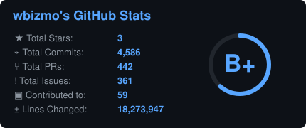
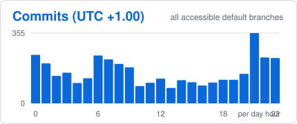
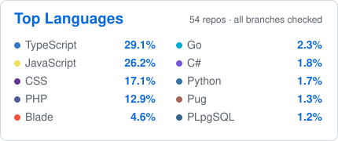
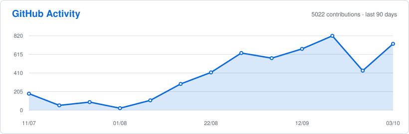

<strong>HELLO THERE — I'M WILLIAMS 👋</strong>

<strong>Software Engineer · Backend · Platform · Infrastructure · Distributed Systems · Security · IoT & Connected Systems</strong>

I build <strong>production software across backend engineering, platform infrastructure, distributed systems, security tooling, IoT and connected devices, web and mobile applications, desktop clients, developer tooling, financial and business platforms, CMS products, data and decision systems, and cloud services</strong>.

My work spans the full path from client, device, or protocol to production infrastructure: <strong>application architecture, APIs, transport and service contracts, authentication and authorization, data systems, messaging, queues, integrations, concurrency control, deployment, observability, reliability, and operational recovery</strong>.

I am especially interested in systems that must remain correct when <strong>money, data, devices, networks, external providers, concurrency, and failures</strong> are involved.

Graduate study: <strong>Master of Science in Financial Engineering (MScFE), WorldQuant University</strong>.

  
  
  

---

<strong>GITHUB ACTIVITY</strong>

<table>
<tr>
<td width="50%" align="center"></td>
<td width="50%" align="center"></td>
</tr>
<tr>
<td width="50%" align="center"></td>
<td width="50%" align="center"></td>
</tr>
</table>

---

<strong>PUBLISHED PRODUCTS</strong>

<table>
<tr>
<td valign="top"><strong><a href="https://www.npmjs.com/package/toolip" target="_blank" rel="noopener noreferrer">Toolip v2.2.1 — Security & Supply-Chain CLI</a></strong> Local-first developer security tooling with one resolved npm dependency inventory across vulnerability analysis and dependency-health scoring, including exact transitive package versions, truthful risk scoring, secret and Git/container analysis, SBOMs, hardened encrypted vaults, MCP workspace isolation and transactional security workflows.     </td>
</tr>
<tr>
<td valign="top"><strong><a href="https://www.npmjs.com/package/launchstack-cli" target="_blank" rel="noopener noreferrer">LaunchStack CLI v3.0.0 — Backend Scaffolding</a></strong> Fastify/TypeScript API generation with Prisma/PostgreSQL, auth, Zod, OpenAPI, Docker, CI and deployment presets.     </td>
</tr>
</table>

---

<strong>OPEN SOURCE</strong>

<table>
<tr>
<td width="100%" valign="top">
<strong><a href="https://wbizmo.zivoralabs.xyz/open-source/nautilus-trader" target="_blank" rel="noopener noreferrer">NautilusTrader · AroonOscillator</a></strong> 
Found and reproduced the accepted <code>MAX_PERIOD = 1024</code> window-capacity bug, then shipped the merged Rust/Python regression fix. Also opened the separate rolling-extrema performance RFC proposing amortized O(1) updates with monotonic deques while preserving newest-occurrence tie semantics.  

</td>
</tr>
<tr>
<td width="100%" valign="top">
<strong><a href="https://wbizmo.zivoralabs.xyz/open-source/nautilus-trader" target="_blank" rel="noopener noreferrer">NautilusTrader · AMAT</a></strong> 
Reported two correctness defects in <code>ArcherMovingAveragesTrends</code>: the Rust path ignored slow-MA direction and trend flags could remain latched across reversals. Opened two independently reviewable Rust fixes with focused regression coverage and full <code>nautilus-indicators</code> crate validation.  

</td>
</tr>
<tr>
<td width="100%" valign="top">
<strong><a href="https://github.com/Okeha/SignrrGPT" target="_blank" rel="noopener noreferrer">SignrrGPT · Backend, Frontend & Inference</a></strong> 
Audited SignrrGPT across its FastAPI/VideoMAE backend and React frontend, then opened upstream fixes for bounded video-upload memory, cloud chat persistence, sample-before-decode inference, first-click WebSocket streaming, duplicate connection races, SSE error propagation, bounded chat-memory lifetime, and local LLM token limits. Also opened an inference-concurrency/backpressure RFC with a bounded-execution prototype. The original umbrella reports were closed after the actionable issues were moved into the repositories where the implementations live.  
<strong>Backend</strong> 

  
<strong>Frontend</strong> 

  
<strong>Umbrella tracking · moved to implementation repositories</strong> 

</td>
</tr>
</table>

---

<strong>TECH STACK</strong>

<table>
<tr>
<td width="50%" valign="top"><strong>Languages</strong>  
       </td>
<td width="50%" valign="top"><strong>Backend & APIs</strong>  
      </td>
</tr>
<tr>
<td valign="top"><strong>Web, Mobile, Desktop & CMS</strong>  
      </td>
<td valign="top"><strong>Data, Persistence & Messaging</strong>  
        </td>
</tr>
<tr>
<td valign="top"><strong>Infrastructure & Delivery</strong>  
       </td>
<td valign="top"><strong>Testing, Security & Data Science</strong>  
       </td>
</tr>
</table>

---

<strong>ENGINEERING PRINCIPLES</strong>

I value <strong>correctness over cleverness</strong>, explicit boundaries, boring-but-reliable infrastructure, measurable failure handling, narrow service contracts, data integrity, maintainable systems, and tests that protect real behavior rather than simply increase coverage numbers.

---

<strong>CONNECT</strong>

  <a href="https://wbizmo.zivoralabs.xyz/" target="_blank" rel="noopener noreferrer">Portfolio</a> ·
  <a href="https://www.linkedin.com/in/wbizmo" target="_blank" rel="noopener noreferrer">LinkedIn</a> ·
  <a href="https://github.com/wbizmo" target="_blank" rel="noopener noreferrer">GitHub</a> ·
  <a href="https://codepen.io/wbizmo" target="_blank" rel="noopener noreferrer">CodePen</a> ·
  <a href="mailto:wbizmo@gmail.com">Email</a>

